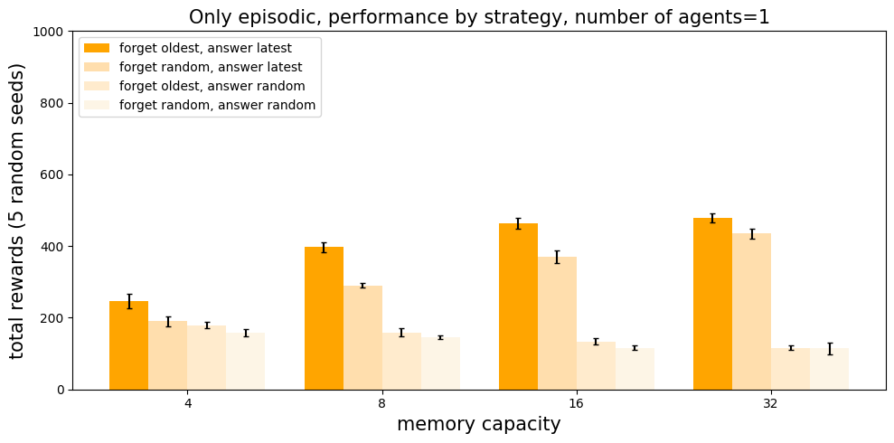
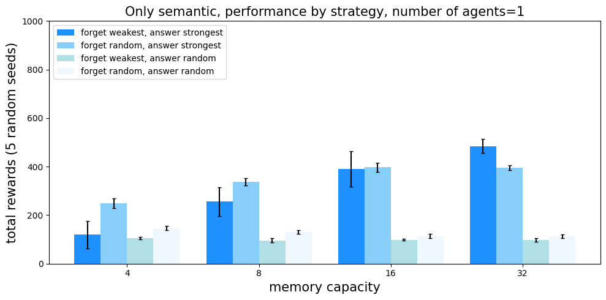
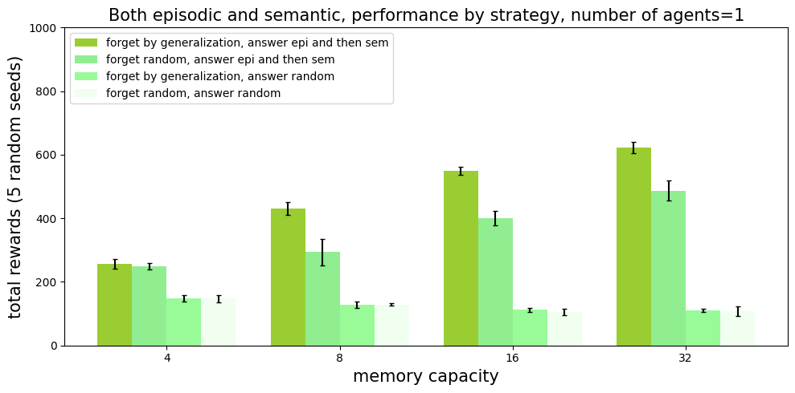
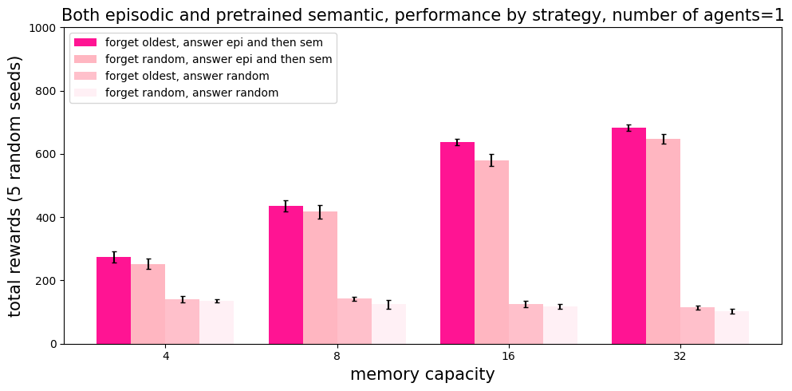
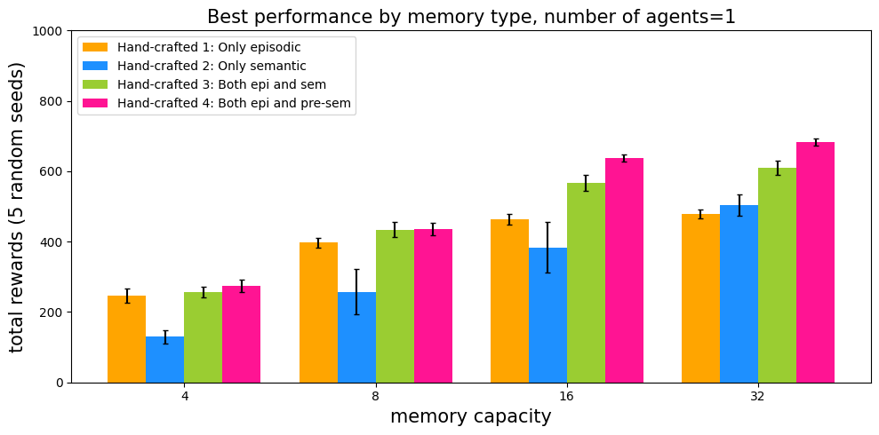
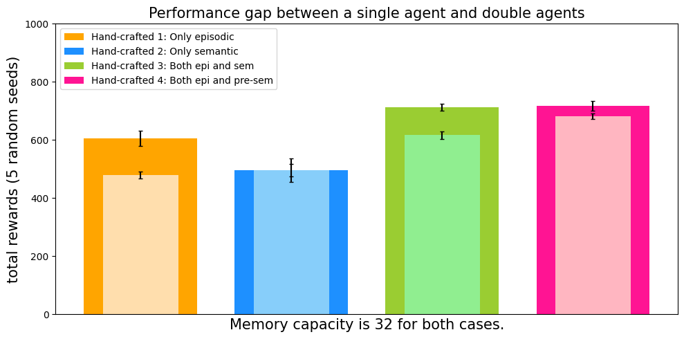

# Agent for RoomEnv-v0

[](https://zenodo.org/doi/10.5281/zenodo.10876424)
[](https://arxiv.org/abs/2204.01611)

This repo is to train an agent that interacts with the
[RoomEnv-v0](https://github.com/humemai/room-env). The agent is not trained with RL, but
with heuristics. See the paper ["A Machine With Human-Like Memory
Systems"](https://arxiv.org/abs/2204.01611) for more information.

## Prerequisites

1. A unix or unix-like x86 machine
1. python 3.10 or higher.
1. Running in a virtual environment (e.g., conda, virtualenv, etc.) is highly
   recommended so that you don't mess up with the system python.
1. Install the requirements by running `pip install -r requirements.txt`

## Run training

```sh
python train.py
```

The hyperparameters can be configured in [`train.yaml`](./train.yaml). The results will
be saved in [`./figures`](./figures).

## Results

|          Handcrafted 1           |          Handcrafted 2           |
| :------------------------------: | :------------------------------: |
|  |  |

|               Handcrafted 3               |                   Handcrafted 4                    |
| :---------------------------------------: | :------------------------------------------------: |
|  |  |

| Total rewards with respect to different handcrafted policies and memory capacities. |
| :---------------------------------------------------------------------------------: |
|                                              |

| Total rewards with respect to the number of agents. The lighter and narrower bars account for the single agent. |
| :-------------------------------------------------------------------------------------------------------------: |
|                                                                   |

## Heuristics

Below are some heuristics for the single and multi agent setups.

### Single Agent Policies

Inspired by the theories on the explicit human memory, we have designed the following
four handcrafted policies (models).

**Handcrafted 1: Only episodic, forget the oldest and answer the latest**. This agent
only has an episodic memory system. When the episodic memory system is full, it will
forget the oldest episodic memory. When a question is asked and there are more than one
relevant episodic memories found, it will use the latest relevant episodic memory to
answer the question.

**Handcrafted 2: Only semantic, forget the weakest and answer the strongest**. This
agent only has a semantic memory system. When the semantic memory system is full, it
will forget the weakest semantic memory. When a question is asked and there are more
than one relevant semantic memories found, it will use the strongest relevant semantic
memory to answer the question.

**Handcrafted 3: Both episodic and semantic**. This agent has both episodic and semantic
memory systems. When the episodic memory system is full, it will forget similar episodic
memories that can be compressed into one semantic memory. When the semantic memory
system is full, it will forget the weakest semantic memory. When a question is asked, it
will first try to use the latest episodic memory to answer it, if it can not, it will
use the strongest relevant semantic memory to answer the question.

**Handcrafted 4: Both episodic and pretrained semantic**. From the beginning of an
episode, the semantic memory system is populated with the ConceptNet commonsense
knowledge. When the episodic memory system is full, it will forget the oldest episodic
memory. When a question is asked, it will first try to use the latest episodic memory to
answer it, if it can not, it will use the strongest relevant semantic memory to answer
the question.

For a fair comparison, every agent has the same total memory capacity. As for the
Handcrafted 3 agent, the episodic and semantic memory systems have the same capacity,
since this agent does not know which one is more important _a priori_. As for the
Handcrafted 4 agent, if there is space left in the semantic memory system after filling
it up, it will give the rest of the space to the episodic memory system. In order to
show the validity of our handcrafted agents, we compare them with the agents that forget
and answer uniform-randomly.

### Multiple Agent Policies

The multiple agent policies work in the same manner as the single agent policies, except
that they can use their combined memory systems to answer questions.

## pdoc documentation

Click on [this link](https://humemai.github.io/agent-room-env-v0) to see the HTML rendered
docstrings

## Contributing

Contributions are what make the open source community such an amazing place to be learn,
inspire, and create. Any contributions you make are **greatly appreciated**.

1. Fork the Project
1. Create your Feature Branch (`git checkout -b feature/AmazingFeature`)
1. Run `make test && make style && make quality` in the root repo directory, to ensure
   code quality.
1. Commit your Changes (`git commit -m 'Add some AmazingFeature'`)
1. Push to the Branch (`git push origin feature/AmazingFeature`)
1. Open a Pull Request

## [Cite our paper](https://arxiv.org/abs/2204.01611)

```bibtex
@misc{https://doi.org/10.48550/arxiv.2204.01611,
  doi = {10.48550/ARXIV.2204.01611},
  url = {https://arxiv.org/abs/2204.01611},
  author = {Kim, Taewoon and Cochez, Michael and Francois-Lavet, Vincent and Neerincx, Mark and Vossen, Piek},
  keywords = {Artificial Intelligence (cs.AI), FOS: Computer and information sciences, FOS: Computer and information sciences},
  title = {A Machine With Human-Like Memory Systems},
  publisher = {arXiv},
  year = {2022},
  copyright = {Creative Commons Attribution 4.0 International}
}
```

## Authors

- [Taewoon Kim](https://taewoon.kim/)
- [Michael Cochez](https://www.cochez.nl/)
- [Vincent Francois-Lavet](http://vincent.francois-l.be/)
- [Mark Neerincx](https://ocw.tudelft.nl/teachers/m_a_neerincx/)
- [Piek Vossen](https://vossen.info/)

## License

[MIT](https://choosealicense.com/licenses/mit/)
